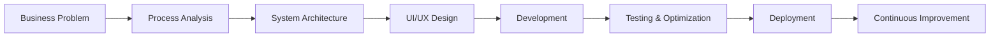

<!-- ========================= HERO ========================= -->

<p align="center">
  
</p>

<p align="center">
  
</p>

<h3 align="center">Digitalization Solutions Architect</h3>

<p align="center">
  I transform complex business processes into scalable, intuitive, and high-performance digital systems.
</p>

<p align="center">
  <a href="https://github.com/Faizal-dev13">
    
  </a>
  <a href="https://linkedin.com/in/Faizal-dev13">
    
  </a>
  <a href="mailto:your-email@example.com">
    
  </a>
</p>

<br/>

<!-- ========================= ABOUT ========================= -->

## 👨‍💻 About Me

I am a full-stack engineer focused on designing and developing digital products that are reliable, maintainable, and easy to use.

My work combines **business analysis**, **system architecture**, **backend development**, and **user experience design** to deliver solutions that are not only technically strong but also aligned with real operational needs.

```yaml
name: Faizal
role: Full-Stack Engineer & Solution Architect
focus:
  - Business Process Digitalization
  - Scalable Web Application Architecture
  - Backend Systems and REST APIs
  - User-Centered Interface Design
  - Deployment and Server Management
principle: Clean architecture, clear experience, measurable impact
```

<br/>

<!-- ========================= EXPERTISE ========================= -->

## 🎯 Core Expertise

<table>
  <tr>
    <td width="50%" valign="top">
      <h3>🏗️ System Architecture</h3>
      <p>
        Designing modular, scalable, and maintainable application structures based on real business workflows.
      </p>
    </td>
    <td width="50%" valign="top">
      <h3>⚙️ Backend Engineering</h3>
      <p>
        Developing secure APIs, authentication systems, payment flows, automation, and complex business logic.
      </p>
    </td>
  </tr>
  <tr>
    <td width="50%" valign="top">
      <h3>🎨 Product & UI/UX</h3>
      <p>
        Creating responsive, intuitive, and efficient user experiences for public websites and internal dashboards.
      </p>
    </td>
    <td width="50%" valign="top">
      <h3>🚀 Deployment & Operations</h3>
      <p>
        Managing application deployment, Linux environments, databases, containers, and production optimization.
      </p>
    </td>
  </tr>
</table>

<br/>

<!-- ========================= TECH STACK ========================= -->

## 🛠️ Technology Stack

### Backend & API

<p>
  
  
  
  
  
</p>

### Frontend & UI/UX

<p>
  
  
  
  
  
</p>

### Database, Server & DevOps

<p>
  
  
  
  
  
  
</p>

<br/>

<!-- ========================= WORKFLOW ========================= -->

## 🔄 How I Build Digital Products



<br/>

<!-- ========================= VALUE ========================= -->

## 💡 Engineering Principles

<table>
  <tr>
    <td align="center" width="25%">
      <h3>Scalable</h3>
      <p>Built to support future growth.</p>
    </td>
    <td align="center" width="25%">
      <h3>Maintainable</h3>
      <p>Clean structure and clear logic.</p>
    </td>
    <td align="center" width="25%">
      <h3>Intuitive</h3>
      <p>Simple and efficient user flows.</p>
    </td>
    <td align="center" width="25%">
      <h3>Reliable</h3>
      <p>Stable, secure, and production-ready.</p>
    </td>
  </tr>
</table>

<br/>

<!-- ========================= ANALYTICS ========================= -->

## 📊 GitHub Analytics

<p align="center">
  
  
</p>

<p align="center">
  
</p>

<p align="center">
  
</p>

<br/>

<!-- ========================= COLLABORATION ========================= -->

## 🤝 Open for Collaboration

I am open to opportunities involving:

* Business process digitalization
* Custom web application development
* Backend and API architecture
* Administrative and operational systems
* Learning management and certification platforms
* Company profiles, portals, and content platforms
* UI/UX improvement and application modernization

<p align="center">
  <a href="https://linkedin.com/in/Faizal-dev13">
    
  </a>
</p>

<br/>

<!-- ========================= FOOTER ========================= -->

<p align="center">
  <i>“Technology should simplify operations, strengthen decisions, and create measurable impact.”</i>
</p>

<p align="center">
  
  
  
</p>

<p align="center">
  
</p>
