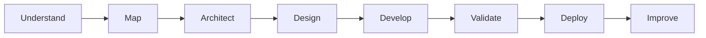

<!-- ====================================================== -->

<!--                       HERO                             -->

<!-- ====================================================== -->

<p align="center">
  
</p>

<div align="center">


<br/>

### I build digital products that simplify operations, improve experiences, and support business growth.

Founder of **Fistechno Digital Solution** and a Full-Stack Engineer specializing in
**business digitalization, scalable web systems, backend architecture, and UI/UX development.**

<br/>


<a href="https://linkedin.com/in/Faizal-dev13">
  
</a>

<a href="mailto:your-email@example.com">
  
</a>

</div>

<br/>

---

<!-- ====================================================== -->

<!--                    PROFESSIONAL INTRO                  -->

<!-- ====================================================== -->

## About Me

<table>
  <tr>
    <td width="62%" valign="top">

I am **Faizal**, Founder of **Fistechno Digital Solution** and a Full-Stack Engineer focused on turning complex operational processes into effective digital systems.

My work combines technical engineering with business understanding. I analyze real operational problems, map user journeys, design scalable architectures, and develop products that are reliable, intuitive, and ready for growth.

I believe good technology should not make a process feel more complicated. It should make work easier, decisions clearer, and services more efficient.

<br/>

```javascript
const faizal = {
  role: "Founder & Full-Stack Engineer",
  company: "Fistechno Digital Solution",

  expertise: [
    "Digital Product Development",
    "Business Process Digitalization",
    "System & Backend Architecture",
    "Responsive UI/UX Engineering",
    "Deployment & Infrastructure"
  ],

  mission: "Transform ideas and business processes into impactful digital solutions"
};
```

  </td>

  <td width="38%" align="center" valign="middle">


  </td>
  </tr>
</table>

<br/>

---

<!-- ====================================================== -->

<!--                     FISTECHNO                          -->

<!-- ====================================================== -->

## Fistechno Digital Solution

<table>
  <tr>
    <td width="34%" align="center" valign="middle">


### Digital solutions built around real business needs.

  </td>

  <td width="66%" valign="top">

**Fistechno Digital Solution** helps businesses and organizations transform ideas, workflows, and services into modern digital products.

We focus on developing solutions that are not only visually attractive, but also functional, scalable, maintainable, and aligned with operational objectives.

#### What We Build

* Custom web applications
* Business management systems
* Administrative and operational dashboards
* Learning and certification platforms
* News portals and content platforms
* Company profiles and public websites
* Backend systems and REST API integrations
* UI/UX modernization and system optimization

  </td>
  </tr>

</table>

<br/>

<div align="center">


</div>

<br/>

---

<!-- ====================================================== -->

<!--                      EXPERTISE                         -->

<!-- ====================================================== -->

## Core Expertise

<table>
  <tr>
    <td width="50%" valign="top">

### 01 — Digital Product Strategy

Translating business challenges into clear product requirements, structured user flows, and practical development roadmaps.

  </td>

  <td width="50%" valign="top">

### 02 — System Architecture

Designing modular, maintainable, and scalable application structures for complex operational requirements.

  </td>
  </tr>

  <tr>
    <td width="50%" valign="top">

### 03 — Full-Stack Development

Developing reliable backend systems, REST APIs, responsive interfaces, dashboards, portals, and business applications.

  </td>

  <td width="50%" valign="top">

### 04 — UI/UX Engineering

Creating clean and intuitive digital experiences with clear hierarchy, efficient interactions, and responsive layouts.

  </td>
  </tr>

  <tr>
    <td width="50%" valign="top">

### 05 — Business Digitalization

Converting manual workflows into structured systems that improve efficiency, traceability, and operational control.

  </td>

  <td width="50%" valign="top">

### 06 — Deployment & Optimization

Preparing applications for production through deployment, server management, debugging, performance improvement, and monitoring.

  </td>
  </tr>
</table>

<br/>

---

<!-- ====================================================== -->

<!--                    TECHNOLOGY STACK                    -->

<!-- ====================================================== -->

## Technology Stack

<div align="center">

### Backend & Application Architecture


<br/><br/>

### Frontend & Product Interface


<br/><br/>

### Database, Infrastructure & Workflow


</div>

<br/>

---

<!-- ====================================================== -->

<!--                    DEVELOPMENT METHOD                  -->

<!-- ====================================================== -->

## How I Build



<table>
  <tr>
    <td align="center" width="25%">
      <h3>Understand</h3>
      <p>Identify the real operational problem.</p>
    </td>

```
<td align="center" width="25%">
  <h3>Architect</h3>
  <p>Design the system, data, and user flow.</p>
</td>

<td align="center" width="25%">
  <h3>Build</h3>
  <p>Develop and validate critical features.</p>
</td>

<td align="center" width="25%">
  <h3>Improve</h3>
  <p>Optimize based on real usage and impact.</p>
</td>
```

  </tr>
</table>

<br/>

---

<!-- ====================================================== -->

<!--                     VALUES                             -->

<!-- ====================================================== -->

## Product Principles

<div align="center">

|                 Clean                |                Intuitive               |            Scalable            |               Reliable               |
| :----------------------------------: | :------------------------------------: | :----------------------------: | :----------------------------------: |
| Clear structure and visual hierarchy | Efficient and understandable user flow | Ready to support future growth | Stable, tested, and production-ready |
|      Maintainable implementation     |          Reduced user friction         |   Modular system architecture  |    Secure and predictable behavior   |

</div>

<br/>

---

<!-- ====================================================== -->

<!--                   GITHUB ANALYTICS                     -->

<!-- ====================================================== -->

## GitHub Overview

<div align="center">


<br/><br/>


<br/><br/>


</div>

<br/>

---

<!-- ====================================================== -->

<!--                   PROFESSIONAL FOCUS                   -->

<!-- ====================================================== -->

## Current Professional Focus

<table>
  <tr>
    <td width="33%" valign="top">

### Business Systems

Building systems that support administrative, financial, educational, and operational workflows.

  </td>

  <td width="33%" valign="top">

### Product Experience

Improving interfaces and user journeys so digital products feel clearer, faster, and easier to use.

  </td>

  <td width="33%" valign="top">

### Scalable Solutions

Developing architectures that remain maintainable as features, users, and business needs continue to grow.

  </td>
  </tr>
</table>

<br/>

---

<!-- ====================================================== -->

<!--                   COLLABORATION                        -->

<!-- ====================================================== -->

## Let's Build Something Valuable

<table>
  <tr>
    <td width="68%" valign="middle">

I am open to collaborations involving:

* Digital product development
* Custom business applications
* Backend and REST API architecture
* Administrative and operational platforms
* Learning and certification systems
* Public websites and content portals
* UI/UX improvement
* Application modernization
* Server deployment and optimization

Through **Fistechno Digital Solution**, I aim to help businesses and organizations create digital products that provide real operational value.

  </td>

  <td width="32%" align="center" valign="middle">


<br/>

<a href="https://linkedin.com/in/Faizal-dev13">
  
</a>

  </td>
  </tr>
</table>

<br/>

---

<!-- ====================================================== -->

<!--                       FOOTER                           -->

<!-- ====================================================== -->

<div align="center">

### Founder of Fistechno Digital Solution

**Building thoughtful digital products through strategy, design, and engineering.**

<br/>


<br/><br/>


</div>
