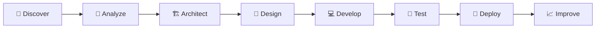

<!-- ===================================================== -->

<!--                     HERO SECTION                      -->

<!-- ===================================================== -->

<div align="center">


<br/>

### Building digital systems that simplify operations and create measurable impact.

I combine **business analysis, system architecture, backend engineering, and UI/UX design**
to transform complex workflows into reliable and intuitive digital products.

<br/>

<a href="https://github.com/Faizal-dev13">
  
</a>
<a href="https://linkedin.com/in/Faizal-dev13">
  
</a>
<a href="mailto:your-email@example.com">
  
</a>

</div>

<br/>

<!-- ===================================================== -->

<!--                       ABOUT ME                        -->

<!-- ===================================================== -->

## `01.` About Me

<table border="0">
  <tr>
    <td width="58%" valign="top">

### Hi, I'm Faizal 👋

A **Full-Stack Engineer and Solution Architect** focused on developing digital products that are scalable, maintainable, and aligned with real business needs.

I do more than write code. I analyze operational problems, design effective user flows, build system architecture, develop application logic, and prepare products for production environments.

```typescript
const faizal = {
  role: "Full-Stack Engineer",
  specialization: [
    "System Architecture",
    "Business Process Digitalization",
    "Backend & REST API Development",
    "Responsive UI/UX Design",
    "Deployment & Server Management"
  ],
  approach: [
    "Understand the real problem",
    "Design the simplest effective flow",
    "Build scalable architecture",
    "Deliver measurable impact"
  ],
  currentFocus: "Building high-impact digital products"
};
```

  </td>
  <td width="42%" align="center" valign="middle">


  </td>
  </tr>
</table>

<br/>

<!-- ===================================================== -->

<!--                    SERVICE CARDS                      -->

<!-- ===================================================== -->

## `02.` What I Build

<table>
  <tr>
    <td width="33%" align="center" valign="top">
      <br/>
      
      <h3>Backend Systems</h3>
      <p>
        Secure APIs, authentication, payment workflows, role management, automation, and complex business logic.
      </p>
    </td>
    <td width="33%" align="center" valign="top">
      <br/>
      
      <h3>Web Applications</h3>
      <p>
        Responsive public websites, participant portals, admin dashboards, and operational systems.
      </p>
    </td>
    <td width="33%" align="center" valign="top">
      <br/>
      
      <h3>Business Digitalization</h3>
      <p>
        Transforming manual workflows into structured, trackable, and efficient digital processes.
      </p>
    </td>
  </tr>
  <tr>
    <td width="33%" align="center" valign="top">
      <br/>
      
      <h3>UI/UX Design</h3>
      <p>
        Clean interfaces, intuitive user flows, responsive layouts, and efficient interaction patterns.
      </p>
    </td>
    <td width="33%" align="center" valign="top">
      <br/>
      
      <h3>Deployment</h3>
      <p>
        Linux servers, VPS environments, application deployment, optimization, and production configuration.
      </p>
    </td>
    <td width="33%" align="center" valign="top">
      <br/>
      
      <h3>System Optimization</h3>
      <p>
        Improving performance, usability, application flow, maintainability, and operational efficiency.
      </p>
    </td>
  </tr>
</table>

<br/>

<!-- ===================================================== -->

<!--                     TECH STACK                        -->

<!-- ===================================================== -->

## `03.` Technology Stack

<div align="center">

### Backend & API


<br/><br/>

### Frontend & Interface


<br/><br/>

### Database, Infrastructure & Tools


</div>

<br/>

<!-- ===================================================== -->

<!--                  TECHNICAL MATRIX                     -->

<!-- ===================================================== -->

## `04.` Technical Capabilities

<table>
  <thead>
    <tr>
      <th align="left">Area</th>
      <th align="left">Capabilities</th>
    </tr>
  </thead>
  <tbody>
    <tr>
      <td><b>Architecture</b></td>
      <td>Modular systems, role-based applications, scalable business workflows, database structure</td>
    </tr>
    <tr>
      <td><b>Backend</b></td>
      <td>REST APIs, authentication, authorization, payment integration, automation, queues</td>
    </tr>
    <tr>
      <td><b>Frontend</b></td>
      <td>Vue.js, React, responsive interfaces, dashboard systems, reusable components</td>
    </tr>
    <tr>
      <td><b>UI/UX</b></td>
      <td>User flow mapping, mobile-first design, information hierarchy, interaction improvement</td>
    </tr>
    <tr>
      <td><b>Operations</b></td>
      <td>VPS deployment, Linux server management, Nginx, Docker, Git workflow</td>
    </tr>
    <tr>
      <td><b>Quality</b></td>
      <td>Functional testing, flow validation, debugging, optimization, maintainable code</td>
    </tr>
  </tbody>
</table>

<br/>

<!-- ===================================================== -->

<!--                    WORK PROCESS                       -->

<!-- ===================================================== -->

## `05.` Development Workflow



<div align="center">

|           Discover           |           Architect          |           Build           |       Deliver       |
| :--------------------------: | :--------------------------: | :-----------------------: | :-----------------: |
| Understand business problems |  Design scalable structures  | Develop reliable products | Deploy and optimize |
|    Map users and workflows   | Define modules and data flow |  Test every critical flow | Measure real impact |

</div>

<br/>

<!-- ===================================================== -->

<!--                  ENGINEERING VALUES                   -->

<!-- ===================================================== -->

## `06.` Engineering Principles

<table>
  <tr>
    <td width="25%" align="center">
      
      <h3>Scalable</h3>
      <p>Ready to grow with users and business requirements.</p>
    </td>
    <td width="25%" align="center">
      
      <h3>Maintainable</h3>
      <p>Clear structures, reusable components, and readable logic.</p>
    </td>
    <td width="25%" align="center">
      
      <h3>Intuitive</h3>
      <p>User flows that are simple, clear, and efficient.</p>
    </td>
    <td width="25%" align="center">
      
      <h3>Reliable</h3>
      <p>Stable, secure, tested, and production-ready.</p>
    </td>
  </tr>
</table>

<br/>

<!-- ===================================================== -->

<!--                      TROPHIES                         -->

<!-- ===================================================== -->

## `07.` GitHub Achievements

<div align="center">


</div>

<br/>

<!-- ===================================================== -->

<!--                    GITHUB STATS                       -->

<!-- ===================================================== -->

## `08.` GitHub Analytics

<div align="center">


<br/><br/>


</div>

<br/>

<!-- ===================================================== -->

<!--                   ACTIVITY GRAPH                      -->

<!-- ===================================================== -->

## `09.` Contribution Activity

<div align="center">


</div>

<br/>

<!-- ===================================================== -->

<!--                   SUMMARY CARDS                       -->

<!-- ===================================================== -->

## `10.` Development Overview

<div align="center">


</div>

<br/>

<!-- ===================================================== -->

<!--                     PROJECT TYPES                     -->

<!-- ===================================================== -->

## `11.` Solutions I Work On

<div align="center">


<br/>


<br/>


</div>

<br/>

<!-- ===================================================== -->

<!--                     COLLABORATE                       -->

<!-- ===================================================== -->

## `12.` Let's Build Something Impactful

<table>
  <tr>
    <td width="65%" valign="middle">

I am open to collaborating on digital products involving:

* Custom web application development
* Business process digitalization
* Backend and REST API architecture
* Administrative and operational systems
* Learning management and certification platforms
* Public websites and content portals
* UI/UX modernization
* Application optimization and deployment

I am especially interested in projects where technology can simplify operations, improve user experience, and produce measurable business value.

  </td>
  <td width="35%" align="center" valign="middle">


<a href="https://linkedin.com/in/Faizal-dev13">
  
</a>

  </td>
  </tr>
</table>

<br/>

<!-- ===================================================== -->

<!--                       QUOTE                           -->

<!-- ===================================================== -->

<div align="center">


</div>

<br/>

<!-- ===================================================== -->

<!--               CONTRIBUTION SNAKE OPTIONAL             -->

<!-- ===================================================== -->

## `13.` Contribution Journey

<div align="center">


<sub>
The contribution animation requires a GitHub Actions workflow in this profile repository.
</sub>

</div>

<br/>

<!-- ===================================================== -->

<!--                       FOOTER                          -->

<!-- ===================================================== -->

<div align="center">

### Technology should simplify operations, strengthen decisions, and create measurable impact.

<br/>


<br/><br/>

**Designed and developed with precision by Faizal Dev**


</div>
